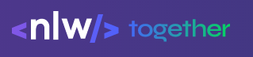

# NLW Valoriza

<p align="center">

</p>

Projeto criado durante o evento Next Level Week da RocketSeat.

## Features

- Cadastro de usuários
- Autenticação via JWT
- Usuários admin podem cadastrar tags de elogios
- Um usuário autenticado pode criar um elogio para outro usuário e adicionar uma tag, como `#inspiração`

## Milha extra

- Uso do postgres como banco de dados ao invés do sqlite
- Criação de contêineres para deploy, usando docker e docker-compose
- Aplicação deployada com nginx em um contêiner como proxy reverso
- Deploy feito em um vps da digital ocean (atualmente fora do ar)
- Criação de pipeline de integração contínua para deploy automatizado usando github actions

## Como rodar

Para rodar o projeto localmente, use o seguinte comando:

```shell
make run
```

Certifique-se de ter o make instalado, bem como o docker e o docker-compose. Caso não coisa rodar usando esse comando, rode diretamente usando o `docker-compose`.

```shell
docker-compose build --build-arg POSTGRES_PASSWORD=senhaqualquer --build-arg MODE=DEVELOPMENT
docker-compose up -d
docker exec nlw-valoriza-app yarn typeorm migration:run
```

Para descer a aplicação:

```shell
make run
```

ou:

```shell
docker-compose down
```
